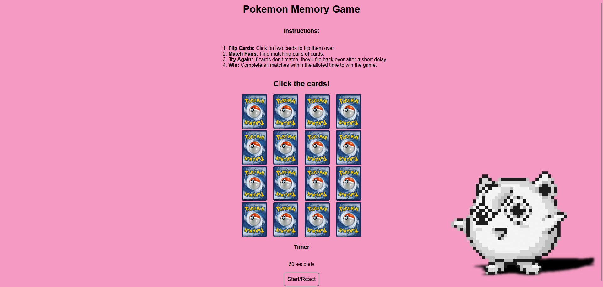

# Pokemon Memory Game 

Link to game: [Pokemon Memory Game](https://www.google.com)

Link to planning materials: [Planning Materials](https://github.com/morganrford/pokemon-memory-game/blob/main/projectplanning.md)

### About the game:

I created a memory card game using Pokemon cards. A memory card game is one where you have to select two cards, and see if they're a match. You have to remember where the cards are in order to get all of the matches. This is a game I used to play often as a child, but with real cards, not on the internet. I decided to choose a Pokemon theme because it's already something that uses cards. I actually wasn't into Pokemon as a child, but I got into Pokemon GO recently because of my boyfriend. He loves Pokemon.

### Instructions:

1. **Flip Cards**: Click on two cards to flip them over.
2. **Match Pairs**: Find matching pairs of cards.
3. **Try Again**: If cards don't match, they'll flip back over after a short delay.
4. **Win**: Complete all matches within the alloted time to win the game.

### Technologies Used:

* HTML
* CSS
* Javascript 

### Planned future enhancements:

* Add a hard-mode
* Add an animation when a player makes a match or when they win
* Add audio when the player starts the game or when they make a match

### Attributions:

The image of the back of the Pokemon card was created by: [Atomic Monkey TCG on DeviantArt](atomicmonkeyTCG.deviantart.com)

The Pokemon cards were taken from: [Pokemon.com](https://www.pokemon.com/us/pokemon-tcg/pokemon-cards)

The background image was taken from: [Wallpaper Cave](https://wallpapercave.com/pink-pokemon-wallpapers)

The pink pokeball icon was taken from: [Clip Art Max](https://www.clipartmax.com/middle/m2i8N4N4N4H7m2A0_cute-pokeball-pixel-by-nikkineko3-8-bit-pokemon-sprites/)

### Sources:

* https://stackoverflow.com/questions/11722400/programmatically-change-the-src-of-an-img-tag
* https://stackoverflow.com/questions/3220697/change-image-alt-with-javascript-onclick
* https://developer.mozilla.org/en-US/docs/Web/API/EventTarget/removeEventListener#matching_event_listeners_for_removal
* https://developer.mozilla.org/en-US/docs/Web/API/Window/setTimeout
* https://www.math.fsu.edu/Computer/chars.math

