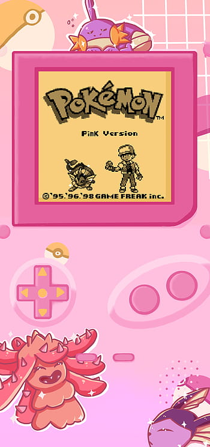

# pokemon-memory-game
## A Pokemon Memory Card Game 

### Planning

1. What I've done so far is created all of the files needed for my project and put in the boilerplate on my HTML document. 

2. The first thing I'll get started on after approval is my html. I'll write my HTML document allowing for a grid of pokemon cards. I'll need to gather my assets to do this including images of the pokemon cards. 

3. The next thing I'll do is work on my styling in css. I'll add my background imagine and change the colors of things. I'll make a grid using flexbox so all of the pokemon cards are where I need them to be. I'll also style my buttons and any other visual features.

4. Then, I will write my javascript adding functionality to my game from what I have learned during the last two games I've coded. I'll have to decide what makes the player win or lose the game, such as will there be a timer, or will too many wrong matches lose the game? I'll have to code a way to turn the cards over, and only allow two cards to be turned over at once. I'll have to code the message telling the user that their match is correct or incorrect, and if they've won or lost. And I'll have to code a reset game function, and many other things.

5. Lastly, I will make sure my code is working properly with no errors, and then I will deploy my site and submit my project. 